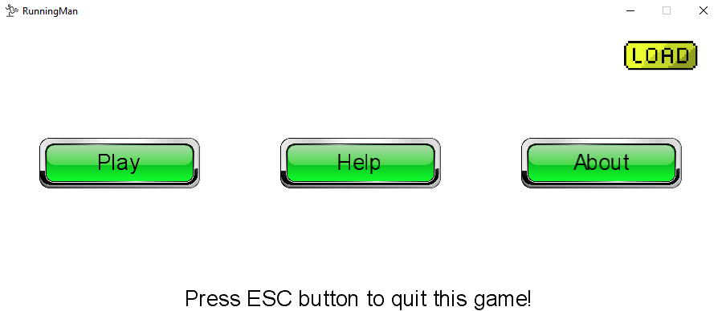
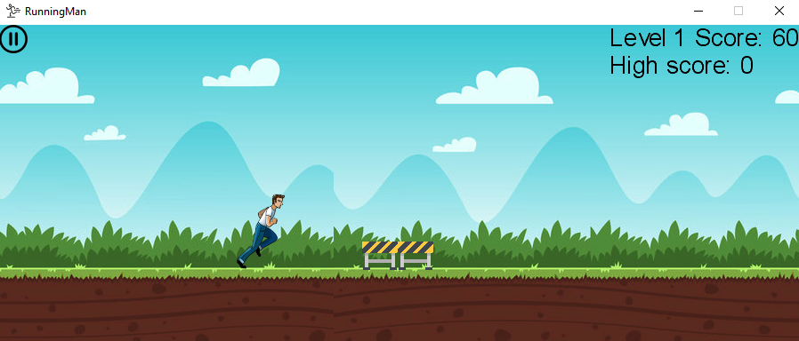
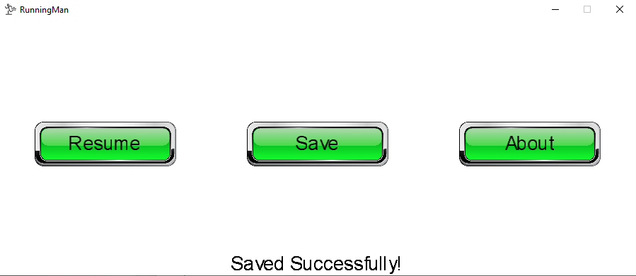
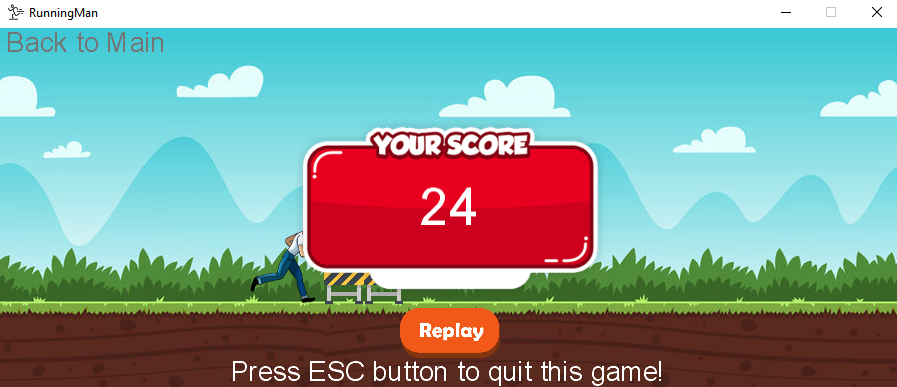

<h1>Running Man Game</h1>

This was made for personal project to practice Monogame extension.

<ul>
  <li>Build a 2D <strong>Monogame</strong> app to play as a running man who need to jump using the mouse left button to avoid obstacles</li>
  <li>Change the game speed and the number of obstacles every 100 points based on the gametime</li>
  <li>Save the game to a text file that override the game information automatically and load the game from the text file to replay</li>
</ul>

  <h4>1. Main Page</h4>
  
  
If you want to play this game, you have to click 'Play' button
   Do you want to know how to play this game? Click 'Help' button
   My inforamtion is saved in 'About' Page

  <h4>2. Game Page</h4>
  
  
The man will jump every time you click the left button of mouse
   If you want to pause the game, you can click the 'pause' button on top left
   The speed and the number of obstacles will be increasing every 100 points

  <h4>3. Pause Page</h4>
  
  
Click 'Resume' button to continue to play your game
   Click 'Save' button to save your game to text file - You can load the game in main page

  <h4>4. Game OVER</h4>
  
  
Push ESC to quit this game
   or You also can replay the game

